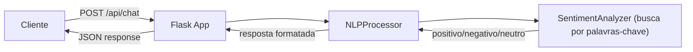
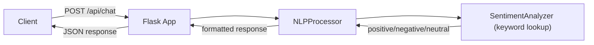

# Conversational-AI-Platform

[Portugues](#portugues) | [English](#english)

---

## Portugues

### Descricao

Plataforma de IA conversacional simples com analise de sentimento baseada em palavras-chave e processamento de linguagem natural basico usando Flask.

### O que este projeto faz

- API Flask com endpoint `/api/chat` que recebe mensagens e retorna analise de sentimento
- Analise de sentimento baseada em palavras-chave (7 palavras positivas + 7 palavras negativas, em portugues e ingles)
- `NLPProcessor` que combina analise de sentimento + estatisticas basicas de texto
- Endpoint `/api/health` para verificacao de saude da aplicacao
- Script de validacao de dados de clientes contra schema JSON

### O que este projeto NAO tem

- Modelos de Machine Learning ou IA real
- NLU (Natural Language Understanding)
- Reconhecimento de intencoes
- Pipeline de NLP real (sem tokenizacao, stemming, etc.)
- Banco de dados
- Extracao de entidades (apenas stub removido)
- Autenticacao ou rate limiting

### Arquitetura



### Tecnologias

- Python
- Flask

### Como executar

```bash
# Clonar o repositorio
git clone https://github.com/galafis/Conversational-AI-Platform.git
cd Conversational-AI-Platform

# Criar ambiente virtual
python -m venv venv
source venv/bin/activate  # No Windows: venv\Scripts\activate

# Instalar dependencias
pip install -r requirements.txt

# Executar a aplicacao
cd src/backend && python app.py
```

O servidor inicia na porta 5000. Exemplo de uso:

```bash
curl -X POST http://localhost:5000/api/chat \
  -H "Content-Type: application/json" \
  -d '{"message": "Estou muito feliz hoje!"}'
```

### Testes

6 testes reais para analise de sentimento e processamento NLP:

```bash
python -m pytest tests/test_nlp.py -v
```

### Estrutura do Projeto

```
Conversational-AI-Platform/
├── src/
│   └── backend/
│       ├── app.py                  # Aplicacao Flask principal
│       ├── models/
│       │   ├── nlp_processor.py    # Processador NLP
│       │   └── sentiment.py        # Analisador de sentimento
│       └── utils/
│           └── validate_customer_data.py  # Validador de dados
├── tests/
│   └── test_nlp.py                 # 6 testes unitarios
├── data/
│   └── datasets/
│       ├── samples/
│       │   └── customer_sample.csv
│       └── schemas/
│           ├── customer_schema.json
│           ├── customer_dictionary.md
│           └── customer_ddl.sql
├── requirements.txt
├── Dockerfile
├── LICENSE
└── README.md
```

### Autor

**Gabriel Demetrios Lafis**
- GitHub: [@galafis](https://github.com/galafis)
- LinkedIn: [Gabriel Demetrios Lafis](https://linkedin.com/in/gabriel-demetrios-lafis)

### Licenca

Este projeto esta licenciado sob a Licenca MIT - veja o arquivo [LICENSE](LICENSE) para detalhes.

---

## English

### Description

Simple conversational AI platform with keyword-based sentiment analysis and basic natural language processing using Flask.

### What this project does

- Flask API with `/api/chat` endpoint that receives messages and returns sentiment analysis
- Keyword-based sentiment analysis (7 positive + 7 negative words, in Portuguese and English)
- `NLPProcessor` that combines sentiment analysis + basic text stats
- `/api/health` endpoint for application health check
- Customer data validation script against JSON schema

### What this project does NOT have

- Machine Learning or real AI models
- NLU (Natural Language Understanding)
- Intent recognition
- Real NLP pipeline (no tokenization, stemming, etc.)
- Database
- Entity extraction (stub only, removed)
- Authentication or rate limiting

### Architecture



### Tech Stack

- Python
- Flask

### How to run

```bash
# Clone the repository
git clone https://github.com/galafis/Conversational-AI-Platform.git
cd Conversational-AI-Platform

# Create virtual environment
python -m venv venv
source venv/bin/activate  # On Windows: venv\Scripts\activate

# Install dependencies
pip install -r requirements.txt

# Run the application
cd src/backend && python app.py
```

The server starts on port 5000. Usage example:

```bash
curl -X POST http://localhost:5000/api/chat \
  -H "Content-Type: application/json" \
  -d '{"message": "I am very happy today!"}'
```

### Tests

6 real tests for sentiment analysis and NLP processing:

```bash
python -m pytest tests/test_nlp.py -v
```

### Author

**Gabriel Demetrios Lafis**
- GitHub: [@galafis](https://github.com/galafis)
- LinkedIn: [Gabriel Demetrios Lafis](https://linkedin.com/in/gabriel-demetrios-lafis)

### License

This project is licensed under the MIT License - see the [LICENSE](LICENSE) file for details.
