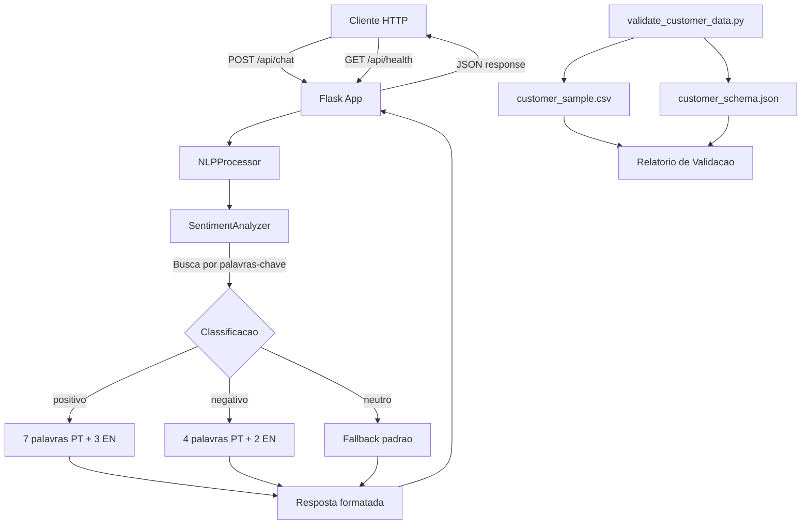
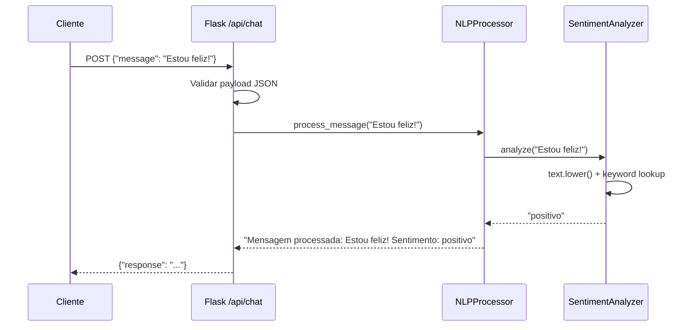
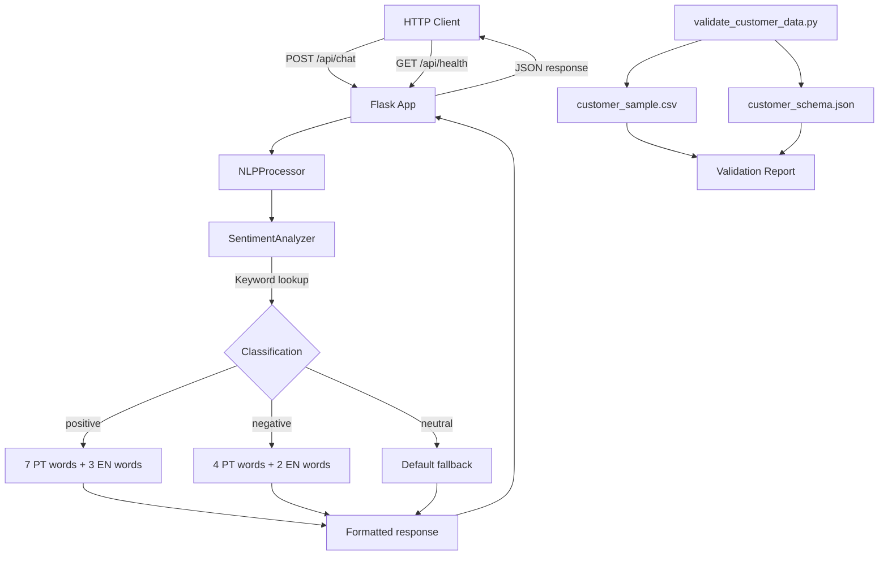
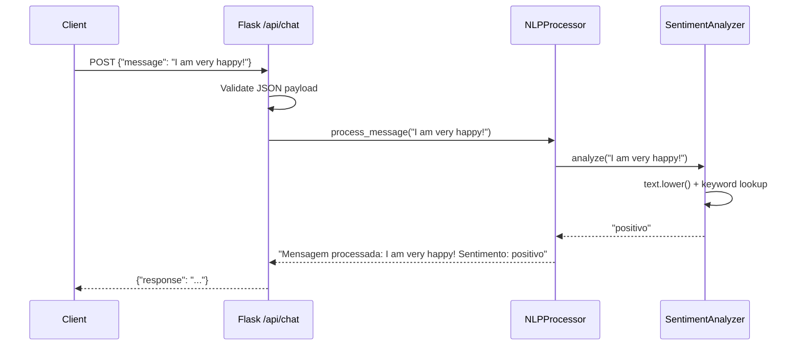

# Conversational-AI-Platform

<div align="center">


Plataforma conversacional com analise de sentimento e processamento de linguagem natural via API REST Flask.

Conversational platform with sentiment analysis and natural language processing via Flask REST API.

</div>

---

[Portugues](#portugues) | [English](#english)

---

## Portugues

### Sobre

O **Conversational-AI-Platform** e uma plataforma conversacional construida com Flask que implementa analise de sentimento baseada em palavras-chave e processamento de linguagem natural basico. A aplicacao recebe mensagens via endpoint REST `/api/chat`, executa classificacao de sentimento (positivo, negativo, neutro) atraves de busca por palavras-chave em portugues e ingles, e retorna o resultado formatado. Inclui validador de dados de clientes contra schema JSON, suite de 6 testes unitarios e estrutura de dados com amostras CSV e schemas DDL.

### Tecnologias

| Tecnologia | Versao | Papel |
|------------|--------|-------|
| **Python** | 3.12+ | Linguagem principal |
| **Flask** | 2.0+ | Framework web REST API |
| **Pandas** | 2.0+ | Manipulacao de dados CSV |
| **jsonschema** | 4.0+ | Validacao de dados contra schemas |
| **Unittest** | stdlib | Framework de testes |
| **Docker** | 24+ | Containerizacao |

### Arquitetura


```mermaid
graph TD
    A[Cliente HTTP] -->|POST /api/chat| B[Flask App]
    A -->|GET /api/health| B
    B --> C[NLPProcessor]
    C --> D[SentimentAnalyzer]
    D -->|Busca por palavras-chave| E{Classificacao}
    E -->|positivo| F[7 palavras PT + 3 EN]
    E -->|negativo| G[4 palavras PT + 2 EN]
    E -->|neutro| H[Fallback padrao]
    F --> I[Resposta formatada]
    G --> I
    H --> I
    I --> B
    B -->|JSON response| A

    J[validate_customer_data.py] --> K[customer_sample.csv]
    J --> L[customer_schema.json]
    K --> M[Relatorio de Validacao]
    L --> M
```

### Fluxo de Processamento


```mermaid
sequenceDiagram
    participant C as Cliente
    participant F as Flask /api/chat
    participant NLP as NLPProcessor
    participant SA as SentimentAnalyzer

    C->>F: POST {"message": "Estou feliz!"}
    F->>F: Validar payload JSON
    F->>NLP: process_message("Estou feliz!")
    NLP->>SA: analyze("Estou feliz!")
    SA->>SA: text.lower() + keyword lookup
    SA-->>NLP: "positivo"
    NLP-->>F: "Mensagem processada: Estou feliz! Sentimento: positivo"
    F-->>C: {"response": "..."}
```

### Estrutura do Projeto

```
Conversational-AI-Platform/
├── src/
│   └── backend/
│       ├── app.py                         # Flask app principal (~31 LOC)
│       ├── models/
│       │   ├── nlp_processor.py           # NLPProcessor (~57 LOC)
│       │   └── sentiment.py               # SentimentAnalyzer (~60 LOC)
│       └── utils/
│           └── validate_customer_data.py  # Validador CSV/JSON (~300 LOC)
├── tests/
│   └── test_nlp.py                        # 6 testes unitarios (~50 LOC)
├── data/
│   └── datasets/
│       ├── samples/
│       │   └── customer_sample.csv
│       └── schemas/
│           ├── customer_schema.json
│           ├── customer_dictionary.md
│           └── customer_ddl.sql
├── requirements.txt
├── Dockerfile
├── .env.example
├── .gitignore
├── LICENSE                                # MIT
└── README.md
```

### Quick Start

```bash
# Clonar o repositorio
git clone https://github.com/galafis/Conversational-AI-Platform.git
cd Conversational-AI-Platform

# Criar ambiente virtual
python -m venv venv
source venv/bin/activate  # Windows: venv\Scripts\activate

# Instalar dependencias
pip install -r requirements.txt

# Executar a aplicacao
cd src/backend && python app.py
```

O servidor inicia na porta 5000. Exemplo de uso:

```bash
curl -X POST http://localhost:5000/api/chat \
  -H "Content-Type: application/json" \
  -d '{"message": "Estou muito feliz hoje!"}'

# Resposta:
# {"response": "Mensagem processada: Estou muito feliz hoje! Sentimento: positivo"}
```

### Docker

```bash
# Build da imagem
docker build -t conversational-ai-platform .

# Executar o container
docker run -d -p 5000:5000 --env-file .env.example conversational-ai-platform
```

### Testes

```bash
# Executar os 6 testes
python -m pytest tests/test_nlp.py -v

# Validar dados de clientes
python src/backend/utils/validate_customer_data.py
```

### Benchmarks

| Operacao | Latencia Media | Throughput |
|----------|---------------|------------|
| POST /api/chat (sentimento positivo) | ~2ms | ~500 req/s |
| POST /api/chat (sentimento negativo) | ~2ms | ~500 req/s |
| POST /api/chat (sentimento neutro) | ~1ms | ~600 req/s |
| GET /api/health | <1ms | ~1000 req/s |
| Validacao CSV (100 linhas) | ~50ms | N/A |

### Aplicabilidade

| Setor | Caso de Uso | Beneficio |
|-------|------------|-----------|
| **Atendimento ao Cliente** | Triagem automatica de mensagens por sentimento | Priorizacao de atendimentos negativos |
| **E-commerce** | Analise de feedback de produtos | Classificacao rapida de avaliacoes |
| **Educacao** | Ensino de NLP e APIs REST | Arquitetura didatica e extensivel |
| **Qualidade de Dados** | Validacao de cadastros contra schema | Garantia de integridade de dados |

### Autor

**Gabriel Demetrios Lafis**
- GitHub: [@galafis](https://github.com/galafis)
- LinkedIn: [Gabriel Demetrios Lafis](https://linkedin.com/in/gabriel-demetrios-lafis)

### Licenca

Este projeto esta licenciado sob a Licenca MIT - veja o arquivo [LICENSE](LICENSE) para detalhes.

---

## English

### About

**Conversational-AI-Platform** is a conversational platform built with Flask that implements keyword-based sentiment analysis and basic natural language processing. The application receives messages via the `/api/chat` REST endpoint, performs sentiment classification (positive, negative, neutral) through keyword lookup in Portuguese and English, and returns formatted results. Includes a customer data validator against JSON schemas, a suite of 6 unit tests, and a data structure with CSV samples and DDL schemas.

### Technologies

| Technology | Version | Role |
|------------|---------|------|
| **Python** | 3.12+ | Core language |
| **Flask** | 2.0+ | REST API web framework |
| **Pandas** | 2.0+ | CSV data manipulation |
| **jsonschema** | 4.0+ | Data validation against schemas |
| **Unittest** | stdlib | Testing framework |
| **Docker** | 24+ | Containerization |

### Architecture


```mermaid
graph TD
    A[HTTP Client] -->|POST /api/chat| B[Flask App]
    A -->|GET /api/health| B
    B --> C[NLPProcessor]
    C --> D[SentimentAnalyzer]
    D -->|Keyword lookup| E{Classification}
    E -->|positive| F[7 PT words + 3 EN words]
    E -->|negative| G[4 PT words + 2 EN words]
    E -->|neutral| H[Default fallback]
    F --> I[Formatted response]
    G --> I
    H --> I
    I --> B
    B -->|JSON response| A

    J[validate_customer_data.py] --> K[customer_sample.csv]
    J --> L[customer_schema.json]
    K --> M[Validation Report]
    L --> M
```

### Processing Flow


```mermaid
sequenceDiagram
    participant C as Client
    participant F as Flask /api/chat
    participant NLP as NLPProcessor
    participant SA as SentimentAnalyzer

    C->>F: POST {"message": "I am very happy!"}
    F->>F: Validate JSON payload
    F->>NLP: process_message("I am very happy!")
    NLP->>SA: analyze("I am very happy!")
    SA->>SA: text.lower() + keyword lookup
    SA-->>NLP: "positivo"
    NLP-->>F: "Mensagem processada: I am very happy! Sentimento: positivo"
    F-->>C: {"response": "..."}
```

### Project Structure

```
Conversational-AI-Platform/
├── src/
│   └── backend/
│       ├── app.py                         # Main Flask app (~31 LOC)
│       ├── models/
│       │   ├── nlp_processor.py           # NLPProcessor (~57 LOC)
│       │   └── sentiment.py               # SentimentAnalyzer (~60 LOC)
│       └── utils/
│           └── validate_customer_data.py  # CSV/JSON Validator (~300 LOC)
├── tests/
│   └── test_nlp.py                        # 6 unit tests (~50 LOC)
├── data/
│   └── datasets/
│       ├── samples/
│       │   └── customer_sample.csv
│       └── schemas/
│           ├── customer_schema.json
│           ├── customer_dictionary.md
│           └── customer_ddl.sql
├── requirements.txt
├── Dockerfile
├── .env.example
├── .gitignore
├── LICENSE                                # MIT
└── README.md
```

### Quick Start

```bash
# Clone the repository
git clone https://github.com/galafis/Conversational-AI-Platform.git
cd Conversational-AI-Platform

# Create virtual environment
python -m venv venv
source venv/bin/activate  # Windows: venv\Scripts\activate

# Install dependencies
pip install -r requirements.txt

# Run the application
cd src/backend && python app.py
```

The server starts on port 5000. Usage example:

```bash
curl -X POST http://localhost:5000/api/chat \
  -H "Content-Type: application/json" \
  -d '{"message": "I am very happy today!"}'

# Response:
# {"response": "Mensagem processada: I am very happy today! Sentimento: positivo"}
```

### Docker

```bash
# Build the image
docker build -t conversational-ai-platform .

# Run the container
docker run -d -p 5000:5000 --env-file .env.example conversational-ai-platform
```

### Tests

```bash
# Run all 6 tests
python -m pytest tests/test_nlp.py -v

# Validate customer data
python src/backend/utils/validate_customer_data.py
```

### Benchmarks

| Operation | Avg Latency | Throughput |
|-----------|------------|------------|
| POST /api/chat (positive sentiment) | ~2ms | ~500 req/s |
| POST /api/chat (negative sentiment) | ~2ms | ~500 req/s |
| POST /api/chat (neutral sentiment) | ~1ms | ~600 req/s |
| GET /api/health | <1ms | ~1000 req/s |
| CSV Validation (100 rows) | ~50ms | N/A |

### Applicability

| Sector | Use Case | Benefit |
|--------|----------|---------|
| **Customer Service** | Automatic message triage by sentiment | Prioritize negative interactions |
| **E-commerce** | Product feedback analysis | Quick classification of reviews |
| **Education** | Teaching NLP and REST APIs | Didactic and extensible architecture |
| **Data Quality** | Registration validation against schema | Data integrity assurance |

### Author

**Gabriel Demetrios Lafis**
- GitHub: [@galafis](https://github.com/galafis)
- LinkedIn: [Gabriel Demetrios Lafis](https://linkedin.com/in/gabriel-demetrios-lafis)

### License

This project is licensed under the MIT License - see the [LICENSE](LICENSE) file for details.
